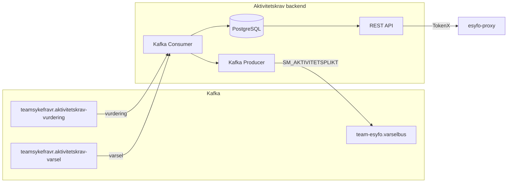

# Aktivitetskrav backendapp

[](https://github.com/navikt/aktivitetskrav-backend/actions/workflows/build-and-deploy.yaml) [](https://spring.io/projects/spring-boot) [](https://kotlinlang.org/) [](https://kafka.apache.org/) [](https://www.postgresql.org/)

## Formålet med appen

Aktivitetskrav-backend er en backend-tjeneste som håndterer **aktivitetskrav** (krav om yrkesrettet aktivitet) for sykmeldte personer i NAV.

- **Konsumerer Kafka-events** fra `teamsykefravr` (vurderinger og varsler om aktivitetskrav)
- **Lagrer data** i PostgreSQL (vurderinger med status, frister og begrunnelser, samt varsler med dokumentkomponenter)
- **Eksponerer REST API** (beskyttet med TokenX) slik at sykmeldte kan se sin aktivitetsplikt-status via `esyfo-proxy`
- **Produserer events** til `team-esyfo.varselbus` for å vise varsler/dokumenter i brukerens mikrofrontend

Mulige statuser er definert i [`AktivitetspliktStatus`](src/main/kotlin/no/nav/syfo/api/dto/Aktivitetsplikt.kt).



## API

| Metode | Sti | Beskrivelse |
|--------|-----|-------------|
| `GET` | `/api/v1/aktivitetsplikt` | Hent gjeldende aktivitetsplikt-status |
| `POST` | `/api/v1/aktivitetsplikt/les` | Marker aktivitetskrav som lest |
| `GET` | `/api/v1/aktivitetsplikt/historikk` | Hent historikk for aktivitetskrav |

Alle endepunkter krever TokenX-autentisering og er kun tilgjengelig via `esyfo-proxy`.

## Utvikling

### Forutsetninger

- JDK 21

### Kjøre tester

```bash
./gradlew test
```

Testene bruker H2 in-memory database (PostgreSQL-kompatibilitetsmodus) og MockOAuth2Server.

> ℹ️ Appen kan ikke kjøres lokalt uten videre — den krever PostgreSQL, Kafka (Aiven) og TokenX som kun er tilgjengelig i NAIS-miljøet.


### 🧹 Kodeformatering

Vi bruker **Ktlint** (`intellij_idea`-stil) for å sikre konsistent Kotlin-formatering.

👉 Installer **Ktlint**-plugin i IntelliJ:
- Gå til *Preferences → Plugins → Marketplace → søk etter "Ktlint" → Install*
- Aktiver deretter **"Format on Save"**

Alternativt kan du alltid kjøre:
```bash
./gradlew ktlintFormat
```

## Henvendelser

Spørsmål knyttet til koden eller prosjektet kan stilles til team-esyfo.

## For NAV-ansatte

Interne henvendelser kan sendes via Slack i kanalen #esyfo.
