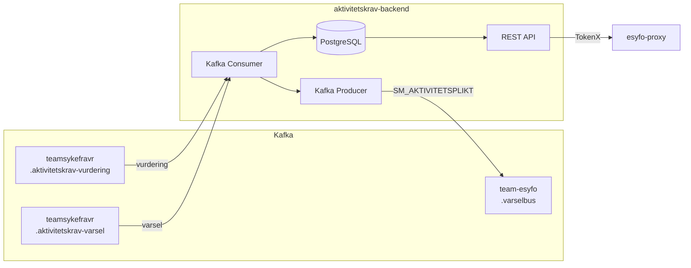

# aktivitetskrav-backend

[](https://github.com/navikt/aktivitetskrav-backend/actions/workflows/build-and-deploy.yaml)
[](https://spring.io/projects/spring-boot)
[](https://kotlinlang.org/)
[](https://kafka.apache.org/)
[](https://www.postgresql.org/)

## Formålet med appen

Aktivitetskrav-backend er en backend-tjeneste som håndterer **aktivitetskrav** (krav om yrkesrettet aktivitet) for sykmeldte personer i NAV.

Appen:

- **Konsumerer Kafka-events** fra `teamsykefravr` med vurderinger og varsler om aktivitetskrav
- **Lagrer data** i PostgreSQL — vurderinger med status, frister og begrunnelser, samt varsler med dokumentkomponenter
- **Eksponerer REST API** (beskyttet med TokenX) slik at sykmeldte kan se sin aktivitetsplikt-status via `esyfo-proxy`
- **Produserer events** til `team-esyfo.varselbus` for å vise varsler og dokumenter i brukerens mikrofrontend

### Dataflyt



## API

Alle endepunkter krever TokenX-autentisering (acr: `Level4` / `idporten-loa-high`) og er kun tilgjengelig via `esyfo-proxy`.

| Metode | Sti | Beskrivelse |
|--------|-----|-------------|
| `GET` | `/api/v1/aktivitetsplikt` | Hent gjeldende aktivitetsplikt-status |
| `POST` | `/api/v1/aktivitetsplikt/les` | Marker aktivitetskrav som lest |
| `GET` | `/api/v1/aktivitetsplikt/historikk` | Hent historikk for aktivitetskrav |

> ℹ️ Det finnes ingen Swagger/OpenAPI-dokumentasjon for dette APIet.

## Utvikling

### Forutsetninger

- JDK 21
- PostgreSQL (eller bruk testprofilen med H2)

### Kjøre appen

```bash
./gradlew bootRun
```

> ⚠️ Appen forventer miljøvariabler for database (`DB_HOST`, `DB_PORT`, `DB_DATABASE`, `DB_USERNAME`, `DB_PASSWORD`), Kafka og TokenX. For lokal utvikling uten disse avhengighetene kan testene kjøres med H2 in-memory database.

### Kjøre tester

```bash
./gradlew test
```

Testene bruker H2 in-memory database (PostgreSQL-kompatibilitetsmodus) og MockOAuth2Server.

### 🧹 Kodeformatering

Vi bruker **Ktlint** (`intellij_idea`-stil) for konsistent Kotlin-formatering.

👉 Installer **Ktlint**-pluginen i IntelliJ:
- Gå til *Preferences → Plugins → Marketplace → søk "Ktlint" → Install*
- Aktiver **"Format on Save"**

Alternativt kan du kjøre:

```bash
./gradlew ktlintFormat
```

## Henvendelser

Spørsmål knyttet til koden eller prosjektet kan stilles til team-esyfo.

## For NAV-ansatte

Interne henvendelser kan sendes via Slack i kanalen #esyfo.
